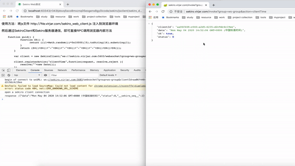

# sekiro

## 黑名单
sekiro测试网站没有提供任何防火墙防护。但是 https://sekiro.virjar.com/ 只是测试网站。方便各位用户提供测试接入。不提供线上服务功能。
如果你希望使用我们系统的线上生产环境，可以走我们商务合作通道(wechat:datiao-world)。以下IP为违规IP，他们使用大量请求调用sekiro网站服务。导致sekiro服务器消耗

## 交流群
[微信交流群-点击打开图片] (http://oss.virjar.com/ratel/sekiro-group.png)


### 封禁时间 2020-10-023
```
115.199.248.162 - - [23/Oct/2020:12:58:44 +0800] "GET /asyncInvoke?group=hubeir330&action=getCookie HTTP/1.1" 200 560 "-" "python-requests/2.22.0" "-"
115.199.248.162 - - [23/Oct/2020:12:58:45 +0800] "GET /asyncInvoke?group=hubeir330&action=getCookie HTTP/1.1" 200 560 "-" "python-requests/2.22.0" "-"
115.199.248.162 - - [23/Oct/2020:12:58:45 +0800] "GET /asyncInvoke?group=hubeir330&action=getCookie HTTP/1.1" 200 560 "-" "python-requests/2.22.0" "-"
115.199.248.162 - - [23/Oct/2020:12:58:45 +0800] "GET /asyncInvoke?group=qgsl&action=getCookie HTTP/1.1" 200 260 "-" "python-requests/2.24.0" "-"
115.199.248.162 - - [23/Oct/2020:12:58:45 +0800] "GET /asyncInvoke?group=hubeir330&action=getCookie HTTP/1.1" 200 560 "-" "python-requests/2.22.0" "-"
115.199.248.162 - - [23/Oct/2020:12:58:45 +0800] "GET /asyncInvoke?group=hubeir330&action=getCookie HTTP/1.1" 200 560 "-" "python-requests/2.22.0" "-"
115.199.248.162 - - [23/Oct/2020:12:58:46 +0800] "GET /asyncInvoke?group=qgsl&action=getCookie HTTP/1.1" 200 260 "-" "python-requests/2.24.0" "-"
115.199.248.162 - - [23/Oct/2020:12:58:46 +0800] "GET /asyncInvoke?group=hubeir330&action=getCookie HTTP/1.1" 200 560 "-" "python-requests/2.22.0" "-"
```
<details>
<summary>历史封禁ip 下拉打开</summary>
    
### 封禁时间 2020-09-06
```
183.128.155.145 - - [06/Sep/2020:08:18:58 +0800] "GET /asyncInvoke?group=hubei&action=getCookie HTTP/1.1" 200 560 "-" "python-requests/2.23.0" "-"
183.128.155.145 - - [06/Sep/2020:08:18:59 +0800] "GET /asyncInvoke?group=hubei&action=getCookie HTTP/1.1" 200 560 "-" "python-requests/2.23.0" "-"
183.128.155.145 - - [06/Sep/2020:08:18:59 +0800] "GET /asyncInvoke?group=hubei&action=getCookie HTTP/1.1" 200 560 "-" "python-requests/2.23.0" "-"
183.128.155.145 - - [06/Sep/2020:08:18:59 +0800] "GET /asyncInvoke?group=hubei&action=getCookie HTTP/1.1" 200 560 "-" "python-requests/2.23.0" "-"
183.128.155.145 - - [06/Sep/2020:08:18:59 +0800] "GET /asyncInvoke?group=hubei&action=getCookie HTTP/1.1" 200 560 "-" "python-requests/2.23.0" "-"
```
<h2>封禁时间：2020-08-28</h2>
<pre>
180.167.211.226 - - [28/Aug/2020:11:15:06 +0800] "GET /asyncInvoke?group=datagrand&action=getCookie HTTP/1.1" 200 1092 "-" "python-requests/2.22.0" "-"
180.167.211.226 - - [28/Aug/2020:11:15:07 +0800] "GET /asyncInvoke?group=datagrand&action=getCookie HTTP/1.1" 200 1092 "-" "python-requests/2.22.0" "-"
180.167.211.226 - - [28/Aug/2020:11:15:07 +0800] "GET /asyncInvoke?group=datagrand&action=getCookie HTTP/1.1" 200 1092 "-" "python-requests/2.22.0" "-"
180.167.211.226 - - [28/Aug/2020:11:15:07 +0800] "GET /asyncInvoke?group=datagrand&action=getCookie HTTP/1.1" 200 1092 "-" "python-requests/2.22.0" "-"
180.167.211.226 - - [28/Aug/2020:11:15:08 +0800] "GET /asyncInvoke?group=datagrand&action=getCookie HTTP/1.1" 200 1092 "-" "python-requests/2.22.0" "-"
</pre>
<h3>封禁时间：2020-08-13</h3>
<ol>
    <li>210.22.76.122</li>
    <li>47.89.31.20</li>
    <li>139.224.22.50</li>
</ol>
</details>


SEKIRO 是一个 android 下的 API 服务暴露框架，可以用在 app 逆向、app 数据抓取、android 群控等场景。

Sekiro 是我之前设计的群控系统 [Hermes](https://gitee.com/virjar/hermesagent) 的升级版，和其他群控框架相比的特点如下：

1. 对网络环境要求低，sekiro 使用长链接管理服务（可以理解为每个APP内置内网穿透功能），使得 Android 手机可以分布于全国各地，甚至全球各地。手机掺合在普通用户群体，方便实现反抓突破，更加适合获取下沉数据。
2. 不依赖 hook 框架，就曾经的 Hermes 系统来说，和 xposed 框架深度集成，在当今 hook 框架遍地开花的环境下，框架无法方便迁移。所以在 Sekiro 的设计中，只提供了 RPC 功能了。
3. 纯异步调用，在 Hermes 和其他曾经出现过的框架中，基本都是同步调用。虽然说签名计算可以达到上百 QPS，但是如果用来做业务方法调用的话，由于调用过程穿透到目标 app 的服务器，会有大量请求占用线程。系统吞吐存在上线(hermes 系统达到 2000QPS 的时候，基本无法横向扩容和性能优化了)。但是 Sekiro 全程使用 NIO，理论上其吞吐可以把资源占满。
4. client 实时状态，在 Hermes 系统我使用 http 进行调用转发，通过手机上报心跳感知手机存活状态。心跳时间至少 20s，这导致服务器调度层面对手机在线状态感知不及时，请求过大的时候大量转发调用由于 client 掉线 timeout。在 Sekiro 长链接管理下，手机掉线可以实时感知。不再出现由于框架层面机制导致 timeout
5. 群控能力，一台Sekiro服务器可以轻松管理上万个手机节点或者浏览器节点，且保证他们的RPC调用没有资源干扰。你不需要关心这些节点的物理网络拓扑结构。不需要管理这些手机什么时候上线和下线。如果你是用naohttpd方案，你可能需要为手机提供一个内网环境，然后配置一套内网穿透。一个内网一个机房，你需要管理哪些机房有哪些手机。当你的手机达到一百台之后，对应的物理网络环境就将会比较复杂，且需要开发一个独立系统管理了。如果你使用的时FridaRPC方案，你可能还需要为每几个手机配置一台电脑。然后电脑再配置内网穿透，这让大批量机器管理的拓扑结构更加复杂。这也会导致手机天然集中在一个机房，存在IP、基站、Wi-Fi、定位等环境本身对抗。
6. 多语言扩展能力。Sekiro的客户端lib库，目前已知存在Android(java)、IOS(objective-c)、js(浏览器)、易语言等多种客户端（不是所有的都是Sekiro官方实现）。Sekiro本身提供一个二进制协议（非常简单的二进制协议规则），只要你的语言支持socket(应该所有语言都支持)，那么你就可以轻松为Sekiro实现对应客户端。接入Sekiro，享受Sekiro本身统一机群管理的好处。在Sekiro的roadmap中，我们会基于frida Socket实现frida的客户端，完成Frida分析阶段的代码平滑迁移到Sekiro的生产环境。尽请期待
7. 客户端接入异步友好。Sekiro全程异步IO设计，这一方面保证整个框架的性能，另一方面更加贴近一般的app或者浏览器本身的异步环境。如果rpc调用用在签名计算上面，大部分签名仅仅是一个算法或者一个so的函数调用。那么同步调用就可以达到非常高的并发。但是如果你想通过rpc调用业务的API（如直接根据参数调用最网络框架的上层API，把参数编解码、加解密都，逻辑拼装都看作黑盒）。此时普通同步调用将会非常麻烦和非常消耗客户端性能。异步转同步的lock信号量机制、同步线程等待导致的线程资源占用和处理任务挤压等风险。FridaRPC支持异步，但是由于他的跨语言问题，并不好去构造异步的callback。目前nanohttpd或者FridaPRC，均大部分情况用在简单的签名函数计算上面。而Sekiro大部分用在上游业务逻辑的直接RPC场景上。
8.API友好（仅对AndroidAPI），我们为了编程方面和代码优雅，封装了一套开箱即用的API，基于SekiroAPI开发需求将会是非常快乐的。


# 部署流程

部署区分服务器端部署和客户端部署，服务器使用 SpringBoot 实现，占三个端口(`server.port: http管理端，同步http`| `natServerPort:手机nat穿透端，和手机长链接`| `natHttpServerPort:NIO的http服务端，只提供RPC调用入口`)
手机端一般附加在 apk 代码逻辑中。

## 服务端部署

两种方式，基于源码部署和 jar 包运行

### 源码部署服务器

执行脚本 `./runProd.sh`

### jar 包部署

1. 当前目录执行代码: `./gradlew sekiro-server:bootJar` 即可在 `sekiro-server/build/libs/sekiro-server-0.0.1-SNAPSHOT.jar`找到 all-in-one 的 jar 包
2. 通过命令 `nohup java -jar sekiro-server/build/libs/sekiro-server-0.0.1-SNAPSHOT.jar >/dev/null 2>&1 &` 即可启动服务器

### docker 部署

[Dockerfile](./Dockerfile)

```sh

# 直接运行, master分支代码aliyun自动构建
docker run --restart=always --name sekiro-server -p 5600:5600 -p 5601:5601 -p 5602:5602 -p 5603:5603 -d registry.cn-beijing.aliyuncs.com/virjar/sekiro-server:latest

# 或者获取源码构建自行构建

git clone https://github.com/virjar/sekiro.git;
cd sekiro;
docker build . -t sekiro-server:latest;
docker run --restart=always --name sekiro-server -p 5600:5600 -p 5601:5601 -p 5602:5602 -p 5603:5603 -d sekiro-server:latest;


```

### 端口配置

在`sekiro-server/src/main/resources/appliation.properties`中可以配置三个服务端端口

## client 使用

需要注意，client api 发布在 maven 仓库，而非 jcenter 仓库

```
dependencies {
    implementation 'com.virjar:sekiro-api:1.0.3'
}
```

然后即可在 apk 代码中书写调用服务逻辑:

```
SekiroClient.start("sekiro.virjar.com",clientId,"sekiro-demo")
        .registerHandler("clientTime",new SekiroRequestHandler(){
            @Override
            public void handleRequest(SekiroRequest sekiroRequest,SekiroResponse sekiroResponse){
                    sekiroResponse.success(" now:"+System.currentTimeMillis()+ " your param1:" + sekiroRequest.getString("param1"));
            }
        });

```

安装 apk 到手机，并打开，然后可以通过服务器访问这个接口

```
http://sekiro.virjar.com/groupList

{"status":0,"message":null,"data":["sekiro-demo"],"clientId":null,"ok":true}


http://sekiro.virjar.com/natChannelStatus?group=sekiro-demo
{"status":0,"message":null,"data":["2e77bbfa_869941041217576"],"clientId":null,"ok":true}


http://sekiro.virjar.com/invoke?group=sekiro-demo&action=clientTime&param1=%E8%87%AA%E5%AE%9A%E4%B9%89%E5%8F%82%E6%95%B0

{"clientId":"2e77bbfa_869941041217576","data":"process: com.virjar.sekiro.demoapp : now:1570546873170 your param1:自定义参数","ok":true,"status":0}

http://sekiro.virjar.com/asyncInvoke?group=sekiro-demo&action=clientTime&param1=%E8%87%AA%E5%AE%9A%E4%B9%89%E5%8F%82%E6%95%B0

{"clientId":"2e77bbfa_869941041217576","data":"process: com.virjar.sekiro.demoapp : now:1570897005965 your param1:自定义参数","ok":true,"status":0}
```

client demo 在`app-demo`子工程可以看到，直接运行 app-demo，即可在 sekiro.virjar.com 看到你的设备列表;

客户端处理任务线程池默认最大线程数量为 16 个，可以根据需求通过 HandlerThreadPool.setMaxWorkSize(int maxWorkSize) 方法进行调整但最大限制为 100；
多线程压测截图：


# 在类似 xposed 的代码注入框架中使用 Sekiro

Sekiro 本身不提供代码注入功能，不过 Sekiro 一般需要和代码注入框架配合产生作用，如和 Xposed 配合，可以方便调用 app 内部私有 API，一般情况下，在 Xposed 入口启动 Sekiro，然后接受服务器指令,并将参数转发到 app 内部。

Sekiro 调用真实 apk 的例子： _为避免风险，现已经移除 Demo_

# 服务器异步 http

sekiro 框架在 http 服务模块，提供了两个 http 端口，分别为 BIO 和 NIO 模式，其中 BIO 模式提供给 tomcat 容器使用，为了方便 springBoot 集成。另一方面，NIO 提供给调用转发模块，NIO 转发过程并不会占用线程池资源，理论上只对连接句柄和 CPU 资源存在瓶颈。

sekiro 的这两个服务分别占用两个不同端口，分别为:

```
#tomcat 占用端口
server.port=5602
#长链接服务占用端口
natServerPort=5600
# 异步http占用端口
natHttpServerPort=5601
```

同时两个请求的 uri 也有一点差异，分别为,

BIO: http://sekiro.virjar.com/invoke?group=sekiro-demo&action=clientTime&param1=%E8%87%AA%E5%AE%9A%E4%B9%89%E5%8F%82%E6%95%B0

NIO: http://sekiro.virjar.com/asyncInvoke?group=sekiro-demo&action=clientTime&param1=%E8%87%AA%E5%AE%9A%E4%B9%89%E5%8F%82%E6%95%B0

可以看到 sekiro 的 demo 网站中，都是占用了统一个端口，这是因为存在 ngnix 转发，你可以参照如下配置实现这个效果:

```
upstream sekiro_server {
  server 127.0.0.1:5602;
}

upstream sekiro_nio {
  server 127.0.0.1:5601;
}

server {
  listen 0.0.0.0:80;
  listen [::]:80;
  server_name sekiro.virjar.com;
  server_tokens off;

  real_ip_header X-Real-IP;
  real_ip_recursive off;


location / {
    client_max_body_size 0;
    gzip off;

    proxy_read_timeout      300;
    proxy_connect_timeout   300;
    proxy_redirect          off;

    proxy_http_version 1.1;

    proxy_set_header    Host                $http_host;
    proxy_set_header    X-Real-IP           $remote_addr;
    proxy_set_header    X-Forwarded-For     $proxy_add_x_forwarded_for;
    proxy_set_header    X-Forwarded-Proto   $scheme;

    proxy_pass http://sekiro_server;
  }

location /asyncInvoke {
    client_max_body_size 0;
    gzip off;

    proxy_read_timeout      300;
    proxy_connect_timeout   300;
    proxy_redirect          off;

    proxy_http_version 1.1;

    proxy_set_header    Host                $http_host;
    proxy_set_header    X-Real-IP           $remote_addr;
    proxy_set_header    X-Forwarded-For     $proxy_add_x_forwarded_for;
    proxy_set_header    X-Forwarded-Proto   $scheme;

    proxy_pass http://sekiro_nio;
  }
}
```

强烈建议使用 NIO 接口访问调用服务

# 接口说明

## 基本概念解释

在 Sekiro 定义中，有几个特殊概念用来描述手机或者业务类型。了解如何使用 Sekiro 之前需要知道这几个概念的含义。

### group

group 的作用是区分接口类型，如在 sekiro 系统中，存在多个不同 app 的服务，那么不同服务通过 group 区分。或者同一个 app 的服务也可能存在差异，如登陆和未登陆分不同接口组，签名计算和
数据请求调用区分不同接口组。Sekiro 不限定 group 具体含义，仅要求 group 作为一个唯一字符串，使用方需要自行保证各自 group 下是的手机业务唯一性。

备注：曾经的 Hermes 系统中，接口组定义为 app 的 packageName，导致同一个 app 的需求，无法进行二次路由，签名计算和数据调用无法隔离。登陆和未登陆手机无法区分

### action

action 代表 group 下的不同接口，可以把 group 叫做接口组，action 代表接口。Sekiro 的服务调用路由最终到达 action 层面，实践经验一般来说同一个 app，或者说同一个业务，大多需要同时
暴露多个接口。action 最终会映射到一个固定的 java handler class 下。

```
SekiroClient.start("sekiro.virjar.com",clientId,"sekiro-demo")
        .registerHandler("clientTime",new SekiroRequestHandler(){
            @Override
            public void handleRequest(SekiroRequest sekiroRequest,SekiroResponse sekiroResponse){
                    sekiroResponse.success(" now:"+System.currentTimeMillis()+ " your param1:" + sekiroRequest.getString("param1"));
            }
        });

```

demo 代码中，会在 group:`sekiro-demo`下暴露一个 action 为:`clientTime`的服务。

### clientId

clientId 用于区分不同手机，同一个接口可以部署在多个手机上，Sekiro 会通过轮询策略分配调用流量(暂时使用轮询策略),客户端需要自行保证 clientId 唯一。如果你没有特殊需要，可以通过 AndroidId，也可以使用随机数。
我更加建议使用手机本身的硬件 Id 作为 clientId，如手机序列号，IMEI。

### bindClient

这是转发服务提供的一个特殊参数，用于指定特定的手机进行转发调用。如果你的业务在某个手机存在多次调用的事务一致性保证需求，或者你需要在 Sekiro 上层系统实现手机资源调用调度。那么通过传递参数可以是的 Sekiro 服务放弃调度策略
管理。或者在问题排查阶段，将请求发送到特定手机用于观察手机状态

备注: Hermes 系统中，存在资源可用性预测算法，使用动态因子完成调用流量负载均衡。Sekiro 有同步该算法的计划，除非有特殊需要，一般不建议 Sekiro 上游系统托管手机资源调度。

备注: 目前 Sekiro 存在四个保留参数，业务放不能使用这几个作为参数的 key，包括:group,action,clientId,invoke_timeOut

## 服务器接口

### 分组列举 /groupList

展示当前系统中注册过的所有 group，如果你新开发一个需求，请注意查询一下系统中已有 group，避免接口组冲突。内部系统定制可以实现 group 申请注册，分配注入准入密码等功能。

### client 资源列举 /natChannelStatus

展示特定 group 下，注册过那些手机。上游如需托管调度，那么需要通过这个接口同步 client 资源。同时也依靠这个接口判定你的客户端是否正确注册。

### 调用转发 /invoke | /asyncInvoke

实现请求到手机的调用转发，区分 invoke 和 asyncInvoke，他们的接口定义一样，只是 asyncInvoke 使用异步 http server 实现，一般情况建议使用 asyncInvoke。

invoke 接口定义比较宽泛，可支持 GET/POST,可支持 `application/x-www-form-urlencoded`和`application/json`,方便传入各种异构参数，不过大多数情况，Get 请求就足够使用。

### 禁用/启用指定设备 /disableClient | /enableClient

如果不想让服务器调度某个设备，可以使用该接口将指定设备踢出调度队列，当然也可以让其重新加入调度队列。

## client 接口

之前多次展示 client 的 demo，这里讲诉一下 client 的食用姿势。

通过 SekiroClient#start 获取一个 SekiroClient 实例，至少需要指定：服务器，clientId。Sekiro 存在多个重载的 start 方法，选择合适的使用即可。如:`SekiroClient.start("sekiro.virjar.com",clientId,"sekiro-demo")`
之后，你需要通过 registerHandler 注册接口，每个 handler 就类似 SpringMVC 里面的一个 controller 方法，用于处理一个特殊的调用请求。

备注: 可以看到，handleRequest 方法没有返回值，这是因为这个接口是异步的，当数据准备好之后通过 response 写会数据即可。千万注意，不要在这个接口中执行网络请求之类的耗时请求，如果有耗时调用，请单独设定线程或者线程池执行。

### SekiroRequest 和 SekiroResponse

分别为业务方请求对象包装，和数据返回句柄。SekiroRequest 有一堆 Get 方法，可以获取请求内容。SekiroResponse 有一堆 send 方法用于回写数据。

### 自动参数绑定

类似 springMVC，在请求调用进入方法的时候，一般框架会支持请求内容自动转化为 java 对象。Sekiro 也支持简单的参数绑定。这可以使得 handler 代码更加优雅。
参数绑定包括参数自动注入，参数自动转换，参数校验等。这个功能可以节省部分 handler 入口对于参数的处理逻辑代码。
如 demo:

```
public class ClientTimeHandler implements SekiroRequestHandler {

    @Override
    public void handleRequest(SekiroRequest sekiroRequest, SekiroResponse sekiroResponse) {
        sekiroResponse.success("process: " + DemoApplication.getInstance().getPackageName() + " : now:" + System.currentTimeMillis() + " your param1:" + sekiroRequest.getString("param1"));
    }
}

```

和如下代码等价:

```
public class ClientTimeHandler implements SekiroRequestHandler {
     //这里自动将请求参数中的param1绑定到handler对象的param1参数中
    @AutoBind
    private String param1;

    @Override
    public void handleRequest(SekiroRequest sekiroRequest, SekiroResponse sekiroResponse) {
        sekiroResponse.success("process: " + DemoApplication.getInstance().getPackageName() + " : now:" + System.currentTimeMillis() + " your param1:" + param1);
    }
}
```

如果参数是一个 map，甚至是一个 java pojo 对象，这里可以支持自动注册。不过需要注意，匿名内部类的 handler 不支持自动绑定参数

## 日志规范

sekiro 代码 Android 和 java server 共用，但是日志框架两端对齐存在问题。服务器端我才用 logback+slf4j 的方案。但是这个方案在 Android 端无法较好的使用，由于 sekiro 多在代码注入环境下使用，
Android 端的 slf4j 的驱动`api 'com.github.tony19:logback-android:1.3.0-2'`依赖 assets 资源配置，或者代码主动配置，这样灵活性不好。

针对于客户端和两端共用代码，我单独抽取日志模块。并实现他们在服务端环境和 Android 端环境的路由切换。Android 端使用原生 logger:`android.util.Log`,服务端使用 slf4j。

sekiro 整体日志，使用同一个 logger 输出。不提供不同模块日志开关或者输出等各种自定义需求。android 端使用 tag:`Sekiro`，服务端使用 name 为：`Sekiro`的 logger。
不过这个名字可以被修改，他是一个静态变量:`com.virjar.sekiro.log.SekiroLogger.tag`

在 android logcat 中，可以通过 tag 过滤 sekiro 相关日志：

```
virjar-share:com.southwestairlines.mobile virjar$ adb logcat -s Sekiro
--------- beginning of system
--------- beginning of crash
--------- beginning of main
11-17 16:28:36.439 27941 27995 I Sekiro  : test sekiro log
11-17 16:28:36.439 27941 27995 I Sekiro  : connect to nat server at service startUp
11-17 16:28:36.450 27941 27997 I Sekiro  : connect to nat server...
11-17 16:28:36.505 27941 28000 I Sekiro  : connect to nat server success:[id: 0x9f83ed84, L:/192.168.0.10:41434 - R:sekiro.virjar.com/47.94.106.20:5600]
11-17 16:28:41.624 27941 28000 I Sekiro  : receive invoke request: group=sekiro-demo&action=clientTime&param1=%E8%87%AA%E5%AE%9A%E4%B9%89%E5%8F%82%E6%95%B0  requestId: 15
11-17 16:28:41.656 27941 28000 I Sekiro  : invoke response: {"data":"process: com.virjar.sekiro.demoapp : now:1573979321626 your param1:自定义参数","ok":true,"status":0}
11-17 16:28:44.443 27941 28000 I Sekiro  : receive invoke request: group=sekiro-demo&action=clientTime&param1=%E8%87%AA%E5%AE%9A%E4%B9%89%E5%8F%82%E6%95%B0  requestId: 16
11-17 16:28:44.445 27941 28000 I Sekiro  : invoke response: {"data":"process: com.virjar.sekiro.demoapp : now:1573979324444 your param1:自定义参数","ok":true,"status":0}
11-17 16:28:45.620 27941 28000 I Sekiro  : receive invoke request: group=sekiro-demo&action=clientTime&param1=%E8%87%AA%E5%AE%9A%E4%B9%89%E5%8F%82%E6%95%B0  requestId: 17
11-17 16:28:45.624 27941 28000 I Sekiro  : invoke response: {"data":"process: com.virjar.sekiro.demoapp : now:1573979325621 your param1:自定义参数","ok":true,"status":0}
```

如果你想托管日志输出规则，那么通过静态方法:`com.virjar.sekiro.log.SekiroLogger.setLogger(com.virjar.sekiro.log.ILogger logger)`覆盖默认实现即可

## 其他语言

目前 sekiro 定位为 Android 框架，如果你在其他平台，或者使用 java 以外的语言接入 sekiro，那么你需要自己实现 Sekiro 的交互协议

协议参见 Sekiro 二进制协议文档: [protoal.md](protocal.md)

### web 注入

Sekiro 已支持 websocket 协议，使用本功能可以支持注入 js 到浏览器后，调用浏览器环境的 js 代码。
Web 环境基于 WebSocket 实现，使用方法也很简单:

```
 <script type="text/javascript" src="http://file.virjar.com/sekiro_web_client.js?_=123"></script>
    <script type="text/javascript">

        var client = new SekiroClient("wss://sekiro.virjar.com/websocket?group=ws-group&clientId=testClient");
        client.registerAction("clientTime",function(request, resolve,reject ){
            resolve(""+new Date());
        })

    </script>
```

你可以运行我们提供的 demo 测试 Sekiro 的 JS RPC 能力 [js_rpc_sekiro_demo.html](jsclient/sekiro_demo.html)




### ssl 问题

如果你要注入的网页是 https 的，那么直接通过我们的 websocket 服务会被浏览器拦截。那么你需要使得你的服务器支持 ssl WebSocket，Sekiro 的 demo 网站已经完成了相关配置。
此时你应该使用 `wss:`协议替代:`ws:`,如：`wss://sekiro.virjar.com/websocket?group=ws-group&clientId=testClient`

## 相关分析文章

[https://github.com/langgithub/sekiro-lang](https://github.com/langgithub/sekiro-lang)

[https://bbs.nightteam.cn/thread-86.htm](https://bbs.nightteam.cn/thread-86.htm)

[https://www.jianshu.com/p/6b71106c45eb?from=timeline](https://www.jianshu.com/p/6b71106c45eb?from=timeline)

## qq Group

569543649

#### 合作

开源即免费，我不限制你们拿去搞事情，但是开源并不代表义务解答问题。如果你发现了有意思的 bug，或者有建设性意见，我乐意参与讨论。
如果你想寻求解决方案，但是又没有能力驾驭这个项目，欢迎走商务合作通道。联系 qq：819154316，或者加群：569543649。
拒绝回答常见问题！！！

#### 内部培训

Sekiro 高阶培训和部分抓取技术课程可在此连接购买 [猿人学·爬虫进阶课](https://detail.youzan.com/show/goods?alias=2okabph85ypv1&activity_alias=undefined)

#### 捐赠

如果你觉得作者辛苦了，可以的话请我喝杯咖啡


